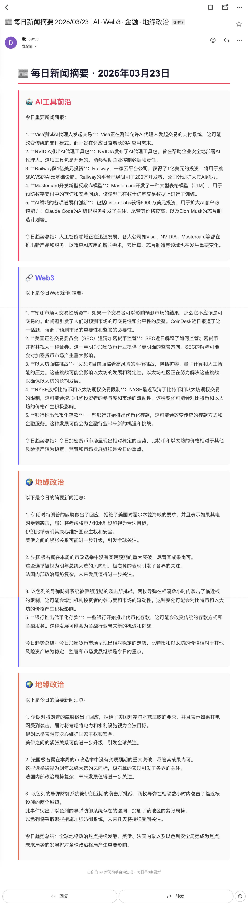

# 📰 AI 每日情报日报系统

> 用 AI 自动抓取 Web3、金融、地缘政治新闻，每日定时推送到邮箱

## 🎯 项目背景

每天需要关注大量信息源，手动筛选效率极低。
这个工具实现了**数据采集 → AI降噪 → 自动推送**的完整 Agent 工作流。

## ✨ 功能特点

- 🤖 自动抓取 4 大类新闻源（AI前沿 / Web3 / 金融 / 地缘政治）
- 📝 LLM 自动总结，每类新闻提炼 3-5 个核心信息点
- 📧 每日北京时间早 8 点自动发送邮件
- ☁️ 部署在 GitHub Actions，零成本全自动运行

## 🛠️ 技术栈

| 工具 | 用途 |
|------|------|
| Python | 核心逻辑 |
| Groq API (LLaMA3) | AI 摘要总结 |
| feedparser | RSS 新闻抓取 |
| GitHub Actions | 定时自动运行 |
| Gmail SMTP | 邮件推送 |

## 🚀 工作流程

RSS 抓取 → AI 摘要 → 邮件推送
↓            ↓          ↓
10个新闻源   Groq LLM   每日早8点

## 📦 本地运行

```bash
git clone https://github.com/xyanyan0905-byte/my-new-digest.git
cd my-new-digest
pip install -r requirements.txt
python main.py


🔧 环境变量配置


|变量名           |说明          |
|--------------|------------|
|GROQ_API_KEY  |Groq API Key|
|EMAIL_SENDER  |发件 Gmail 地址 |
|EMAIL_PASSWORD|Gmail App 密码|
|EMAIL_RECEIVER|收件邮箱地址      |

📬 邮件效果
每日收到包含以下板块的 HTML 邮件：
	∙	🤖 AI工具前沿
	∙	🔗 Web3 动态
	∙	💰 金融市场
	∙	🌍 地缘政治
## 📬 效果截图



用 Cursor + AI 独立开发 · 从零到部署用时 1 天
